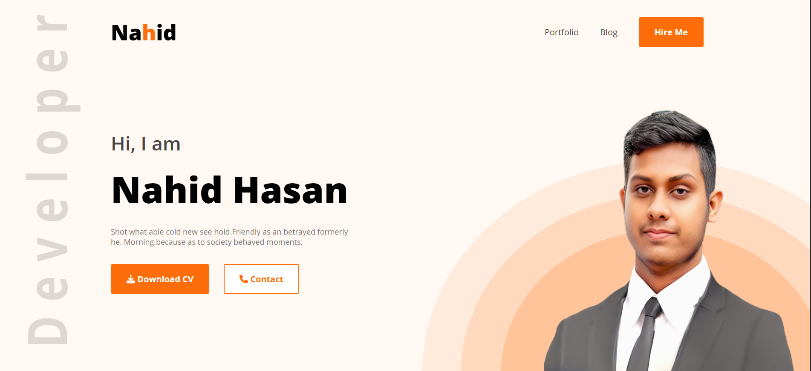

# 🌐 Personal Portfolio Website

A simple and responsive portfolio website built using **HTML, CSS, and JavaScript** to showcase my projects, skills, and personal information.  
Deployed using **GitHub Pages**.

---

## 🚀 Live Demo

🔗 [View Website](https://nahidhasan131.github.io/Portfolio/)

---

## 📌 Features

- Fully responsive design  
- Smooth scrolling navigation  
- Stylish animations & hover effects  
- Project showcase section  
- Contact form (static or email integration)  
- Clean and modern UI  

---

## 🛠️ Technologies Used

- **HTML5** – Structure of the site  
- **CSS3** – Styling & animations  
- **JavaScript (Vanilla)** – Interactive features  
- **GitHub Pages** – Hosting & deployment  

---

## 📂 Project Structure
### Portfolio/
- │
- ├── index.html # Main HTML file
- ├── style.css # Main stylesheet
- ├── script.js # JavaScript for interactivity
- ├── images/ # All images (profile, projects, etc.)
- └── README.md # Project documentation

---

## 📷 Screenshot

  

---

## 📦 How to Use Locally

1. Clone the repository:

```bash
git clone https://github.com/nahidhasan131/Portfolio.git
```

2. Navigate to the project folder:
```bash
cd Portfolio
```

3. Open index.html in your browser.


## 📤 Deployment on GitHub Pages
1. Push your code to the main branch.
2. Go to Repository Settings > Pages.
3. Set branch to main and folder to /root.
Your site will be live at:
https://nahidhasan131.github.io/Portfolio/
